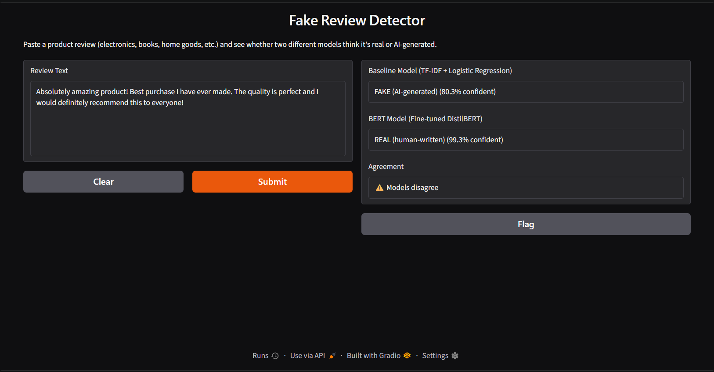

# Fake Review Detector

A machine learning project that detects whether a product review is human-written or AI-generated.

The project compares a traditional **TF-IDF + Logistic Regression** model with a fine-tuned **DistilBERT** model to see how much better a transformer performs on this task.

## Demo



The project includes a **Gradio** interface where you can paste a review and get predictions from both models side by side.

## Dataset

The model was trained on the **Fake Reviews Dataset** from Kaggle.

* 40,432 reviews
* 10 product categories
* 20,216 human-written reviews
* 20,216 computer-generated reviews

Labels:

* `OR` — Original / human-written
* `CG` — Computer-generated

## Models

**Baseline:** TF-IDF + Logistic Regression

**Main model:** Fine-tuned DistilBERT

The baseline gives us a simple reference point, while DistilBERT can use the context and structure of the review rather than just individual words.

## Results

| Model                        |  Accuracy |
| ---------------------------- | --------: |
| TF-IDF + Logistic Regression |     86.2% |
| Fine-tuned DistilBERT        | **98.3%** |

DistilBERT improved the accuracy by about **12 percentage points** over the baseline.

## Running the Project

Install the required packages:

```bash
pip install -r requirements.txt
```

Then run:

```bash
python app.py
```

The app will open the Gradio interface locally.

## Project Structure

```text
├── app.py
├── baseline_broad.py
├── bert_broad.py
├── explore_broad.py
├── fake reviews dataset.csv
└── README.md
```

## Why I Made This

I wanted to compare a traditional NLP approach with a transformer model on the same problem and see how much difference contextual language understanding actually makes.

## Limitations

The model was trained on a specific fake-review dataset, so its performance may differ on reviews from other sources or domains.
